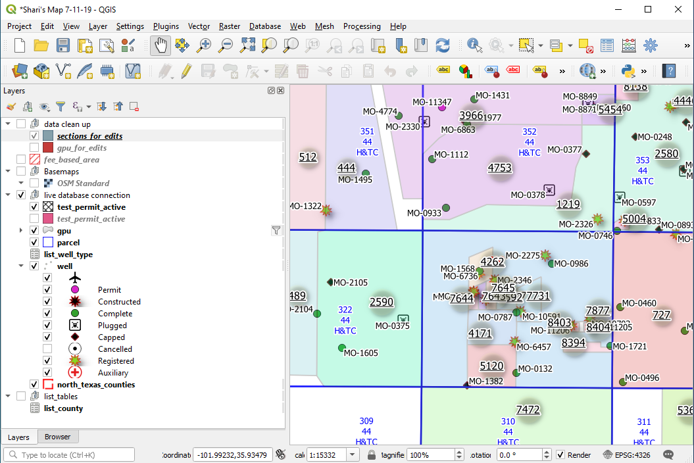

Software: QGIS 3.10.x  

We are going to isntall the new version of QGIS Long Term Release:

1. Go to the QGIS download page at https://www.qgis.org/en/site/forusers/download.html

2. Download the current **Long Term Standalone Release** for 3.10.x

3. Save any Current QGIS Projects you have open. Close QGIS.

4. Install the file you just downloaded. When it installs you can open the new QGIS 3.10 and run your saved projects.

5. One thing you will see as you are working is this new dialog box. All this new dialong box means is **THERE IS A LOT OF MATH**. So much math no one wants to learn about it. So - anything highlighted in Blue is right and if you click the "Make Default" box in the right and this will go away and you'll rarely see it

6. In about a week I would uninstall the old QGIS version by going to Settings -> Apps & Features and remove the old version of QGIS.
